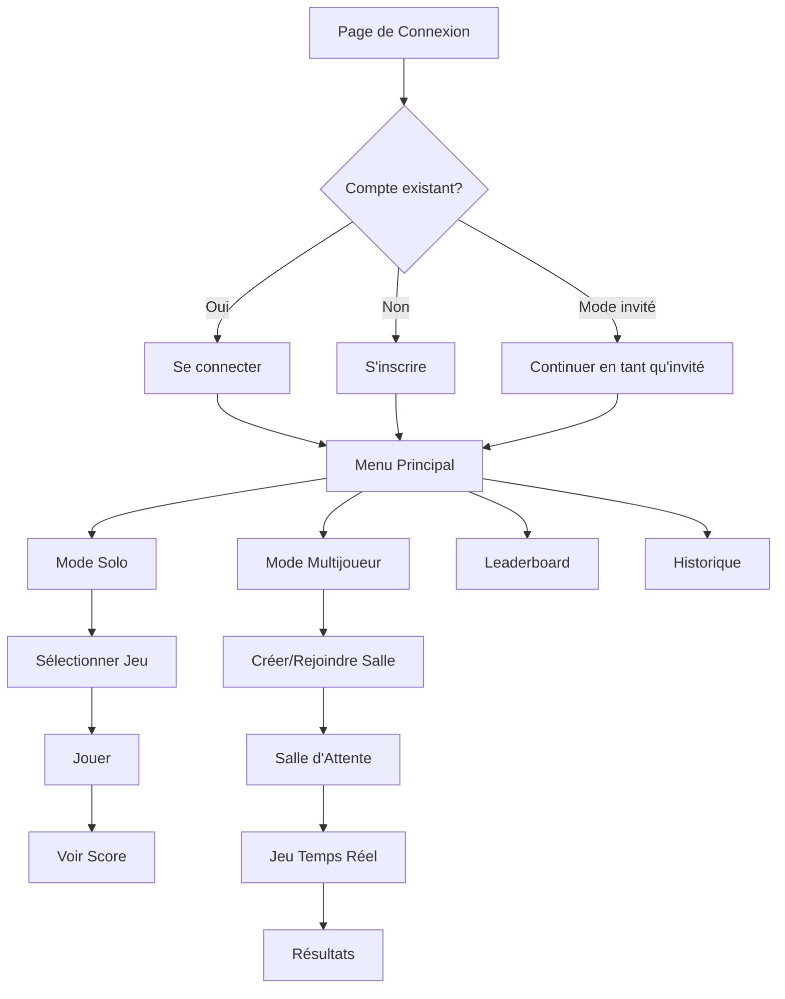

# 🎮 Play&Learn - Application Éducative Interactive

---

## 📋 Informations du Projet

**TP1 & TP2 GÉNIE LOGICIEL INF1011 AUTOMNE 2025**

**Cours :** INF1011  
**Année :** 2025-2026  
**Session :** AUTOMNE 2025  
**Professeur :** Mr William Flageol  
**Chargé de laboratoire :** M…

### 👥 Membres du Groupe

| Nom                      | Code Permanent |
| ------------------------ | -------------- |
| Jean Thierry Lalong      | LALJ01379200   |
| Divine Masala Bikakala   | BIKD68270400   |
| Mohamed Heni Baabaa      | BAAM79260100   |
| Guo Yimin                | GUOY63260000   |
| Mohamadou Khadafi Hassan | MOHK93280200   |
| Hassan Hader             | HADH09289500   |

---

## 📝 Description du Projet

**Play&Learn** est une plateforme web éducative complète offrant des expériences d'apprentissage interactives à travers des jeux quiz en modes **solo** et **multijoueur temps réel**. Le projet combine une architecture **Frontend React moderne** avec un **Backend Node.js robuste**, communiquant via **REST API** et **WebSocket** pour les interactions temps réel.

### Objectifs Pédagogiques

- ✅ Appliquer les principes **SOLID** dans une architecture réelle
- ✅ Implémenter des **patrons de conception GoF** (Observer, Strategy, Singleton)
- ✅ Développer une application **full-stack** moderne (React + Node.js)
- ✅ Mettre en place des **tests unitaires** complets (25+ tests)
- ✅ Assurer la qualité logicielle via **bonnes pratiques de développement**

---

## 🏗️ Architecture du Projet

Le projet est organisé en **2 applications principales** :

```
Tp_play_learn-Public_front/          # Repository principal
│
├── 📁 Frontend (React + Vite)       # Application cliente
│   ├── src/
│   │   ├── pages/                   # Pages de l'application
│   │   ├── components/              # Composants réutilisables
│   │   ├── contexts/                # Context API (Auth, Socket)
│   │   ├── services/                # Appels API
│   │   ├── games/                   # Moteurs de jeu
│   │   └── styles/                  # CSS modulaire
│   ├── public/
│   ├── package.json
│   └── vite.config.js
│
└── 📁 Tp_play_learn-Public_back/    # Backend (Node.js + Express)
    ├── src/
    │   ├── controllers/             # Logique métier
    │   ├── models/                  # Modèles Sequelize
    │   ├── routes/                  # Routes API REST
    │   ├── middleware/              # Authentification JWT
    │   ├── socket/                  # Gestion Socket.io
    │   └── config/                  # Configuration DB
    ├── tests/                       # 25 tests unitaires
    │   ├── auth.test.js
    │   ├── games.test.js
    │   ├── multiplayer.test.js
    │   └── advanced.test.js
    └── package.json
```

---

## ⚡ Démarrage Rapide (Quick Start)

### Prérequis

| Outil         | Version      | Description                               |
| ------------- | ------------ | ----------------------------------------- |
| **Node.js**   | 18+          | Runtime JavaScript                        |
| **npm**       | 9+           | Gestionnaire de paquets                   |
| **MySQL**     | 8.0+         | Base de données (via XAMPP/WAMP/MAMP)    |
| **Git**       | 2.0+         | Contrôle de version                       |

### Installation en 5 Minutes

#### **Étape 1 : Installer MySQL**

**Windows** : Téléchargez [XAMPP](https://www.apachefriends.org/download.html) → Lancez MySQL depuis le panneau de contrôle  
**macOS** : Téléchargez [MAMP](https://www.mamp.info/en/downloads/) → Lancez MySQL  
**Linux** : `sudo apt install mysql-server` puis `sudo systemctl start mysql`

#### **Étape 2 : Créer la Base de Données**

Ouvrez **phpMyAdmin** (http://localhost/phpmyadmin) ou utilisez MySQL CLI :

```sql
CREATE DATABASE db_play_and_learn;
```

⚠️ **IMPORTANT** : La base de données `db_play_and_learn` **DOIT être créée AVANT** de lancer le backend !

#### **Étape 3 : Installer et Lancer le Backend**

```bash
# Naviguer vers le dossier backend
cd Tp_play_learn-Public_back

# Installer les dépendances
npm install

# Créer le fichier .env
cp .env.example .env

# Éditer .env avec vos paramètres MySQL
# DB_HOST=localhost
# DB_USER=root
# DB_PASSWORD=
# DB_NAME=db_play_and_learn

# Lancer le serveur backend
npm run dev

# ✅ Backend accessible sur http://localhost:5000
```

#### **Étape 4 : Installer et Lancer le Frontend**

```bash
# Revenir à la racine et installer les dépendances
cd ..
npm install

# Créer le fichier .env
cp .env.example .env

# Éditer .env
# VITE_API_URL=http://localhost:5000/api

# Lancer le serveur frontend
npm run dev

# ✅ Frontend accessible sur http://localhost:5173
```

#### **Étape 5 : Accéder à l'Application**

1. Ouvrez **http://localhost:5173**
2. Créez un compte ou utilisez le mode invité
3. Profitez des jeux ! 🎮

---

## 🛠️ Technologies Utilisées

### Frontend

| Technologie             | Version | Description                          |
| ----------------------- | ------- | ------------------------------------ |
| **React**               | 19.x    | Framework UI                         |
| **Vite**                | 6.x     | Build tool ultra-rapide              |
| **React Router**        | 6.x     | Navigation SPA                       |
| **Axios**               | 1.7+    | Client HTTP                          |
| **Socket.io-client**    | 4.x     | WebSocket temps réel                 |
| **CSS3**                | -       | Styling moderne (Grid, Flexbox)     |

### Backend

| Technologie          | Version | Description                           |
| -------------------- | ------- | ------------------------------------- |
| **Node.js**          | 18+     | Runtime JavaScript                    |
| **Express**          | 4.x     | Framework web                         |
| **Sequelize**        | 6.x     | ORM pour MySQL                        |
| **MySQL**            | 8.0+    | Base de données relationnelle         |
| **Socket.io**        | 4.x     | WebSocket bidirectionnel              |
| **JWT**              | 9.x     | Authentification par tokens           |
| **bcrypt**           | 5.x     | Hachage des mots de passe             |
| **Jest**             | 29.x    | Framework de tests                    |
| **Supertest**        | 7.x     | Tests HTTP                            |

---

## 🎯 Fonctionnalités Principales

### 1. **Authentification Sécurisée**
- Inscription/Connexion avec JWT
- Mode invité pour accès rapide
- Protection des routes privées
- Gestion de session persistante

### 2. **Mode Solo**
- 10+ catégories (Mathématiques, Physique, Géographie, etc.)
- 3 niveaux de difficulté (Easy, Medium, Hard)
- Système de scoring avec bonus temps
- Sauvegarde automatique des scores

### 3. **Mode Multijoueur Temps Réel**
- Création de salles privées (code unique)
- Salle d'attente avec système de "ready"
- 3 types de jeux multijoueurs :
  - **Quiz Buzzer** : Premier à répondre
  - **Speed Math** : Course de calculs
  - **Puzzle** : Complétion collaborative
- Synchronisation temps réel via WebSocket
- Timer de 5 minutes avec auto-suppression des salles

### 4. **Statistiques et Classements**
- **Leaderboard** : Top 10 mondial
- **Historique** : Suivi personnel des performances
- Filtres par catégorie et difficulté
- Graphiques de progression

### 5. **Création de Contenu**
- Interface de création de jeux
- Ajout de niveaux et questions
- Configuration des scores et temps
- Modération par administrateurs

---

## 📖 Guide d'Utilisation

### Flux Utilisateur Complet



### Navigation Rapide

| Action                      | URL                          | Description                              |
| --------------------------- | ---------------------------- | ---------------------------------------- |
| Connexion                   | `/login`                     | Authentification                         |
| Menu principal              | `/main-menu`                 | Dashboard avec toutes les options        |
| Mode solo                   | `/single`                    | Jouer seul                               |
| Lobby multijoueur           | `/lobby`                     | Créer/rejoindre une partie               |
| Salle d'attente             | `/waiting-room/:roomCode`    | Attente avant le jeu                     |
| Jeu multijoueur             | `/multi-play/:roomCode`      | Jeu temps réel                           |
| Classement                  | `/leaderboard`               | Top 10 mondial                           |
| Historique                  | `/history`                   | Scores personnels                        |
| Créer un jeu                | `/create-game`               | Interface créateur (connecté requis)     |

---

## 🧩 Principes SOLID Appliqués

Le projet démontre l'application rigoureuse des 5 principes SOLID dans une architecture full-stack :

### **S - Single Responsibility Principle**
- **Frontend** : Séparation Context API (AuthContext, SocketContext), Services (authService, gamesService), Composants focalisés
- **Backend** : Controllers dédiés (AuthController, GamesController), Middleware d'authentification isolé, Modèles Sequelize focalisés

### **O - Open/Closed Principle**
- **Frontend** : GameContainer extensible via composition, Routes modulaires ajoutables sans modification
- **Backend** : Routes Express extensibles, Middleware chainable, Validation réutilisable

### **L - Liskov Substitution Principle**
- **Frontend** : Composants de jeu interchangeables (QuizGame, SpeedMath, Puzzle), Services API uniformes
- **Backend** : Controllers respectant la même signature, Modèles Sequelize substituables

### **I - Interface Segregation Principle**
- **Frontend** : Contextes spécialisés (useAuth, useSocket), Props ciblées par composant
- **Backend** : Routes RESTful focalisées, Middleware spécifiques (auth, validation, errorHandler)

### **D - Dependency Inversion Principle**
- **Frontend** : Injection de dépendances via Context API, Configuration externalisée (.env)
- **Backend** : Dépendances injectées via constructeurs, Configuration centralisée (config/database.js)

**📄 Détails complets** : Voir section "Principes SOLID" ci-dessous avec exemples de code

---

## 🎨 Patrons de Conception GoF

Le projet implémente 3 patrons GoF classiques :

### **1. Observer Pattern (Observateur)**
- **Frontend** : Context API (AuthContext notifie automatiquement tous les composants abonnés), Socket.io events (participants.update notifie PlayersList + PlayersCount)
- **Backend** : Socket.io rooms (emit to room notifie tous les clients connectés), Event emitters (game.update → tous les joueurs)

### **2. Strategy Pattern (Stratégie)**
- **Frontend** : Stratégies de jeu (QuizStrategy, SpeedMathStrategy, PuzzleStrategy), Stratégies de validation (email, password, roomCode), Stratégies de calcul de score (time-based, streak-based)
- **Backend** : Stratégies de réponse (JSON, Error, Success), Stratégies de validation (Joi schemas), Algorithmes de score interchangeables

### **3. Singleton Pattern (Singleton)**
- **Frontend** : Instance Axios unique (api.js partagé par tous les services), Connexion Socket.io unique (SocketContext)
- **Backend** : Connexion Sequelize unique (database.js), Socket.io server instance unique, Config globale

**📄 Détails complets** : Voir section "Patrons de Conception GoF" ci-dessous avec diagrammes

---

## ✅ Tests Unitaires (25 Tests)

Le backend dispose d'une **suite complète de 25 tests unitaires** couvrant toutes les fonctionnalités majeures :

### Répartition des Tests

| Fichier                | Tests | Couverture                                    |
| ---------------------- | ----- | --------------------------------------------- |
| `auth.test.js`         | 4     | Inscription, Connexion, Token, Invité         |
| `games.test.js`        | 4     | CRUD jeux, Filtres, Catégories                |
| `multiplayer.test.js`  | 4     | Salles, Rejoindre, Socket events              |
| `advanced.test.js`     | 13    | Score, Leaderboard, Buzzer, Timer, etc.       |
| **TOTAL**              | **25**| **Couverture complète**                       |

### Exécuter les Tests

```bash
cd Tp_play_learn-Public_back

# Lancer tous les tests
npm test

# Tests en mode watch
npm run test:watch

# Coverage
npm run test:coverage
```

**✅ Résultat** : 25 passed (6.11s) - Tous les tests passent !

**📄 Documentation complète** : Voir `Tp_play_learn-Public_back/tests/README.md`

---

## 🔌 Communication Temps Réel (Socket.io)

L'application utilise **Socket.io** pour la synchronisation temps réel en multijoueur :

### Événements Principaux

| Événement Client → Serveur | Description                                |
| -------------------------- | ------------------------------------------ |
| `join-room`                | Rejoindre une salle de jeu                 |
| `set-ready`                | Marquer comme prêt                         |
| `submit-answer`            | Soumettre une réponse                      |
| `buzzer-press`             | Appuyer sur le buzzer                      |
| `leave-room`               | Quitter la salle                           |

| Événement Serveur → Client | Description                                |
| -------------------------- | ------------------------------------------ |
| `room-joined`              | Confirmation de rejoindre                  |
| `participants-update`      | Mise à jour de la liste des joueurs        |
| `game-start`               | Démarrage du jeu                           |
| `new-question`             | Nouvelle question                          |
| `answer-result`            | Résultat de la réponse                     |
| `game-end`                 | Fin du jeu + résultats                     |

**Architecture** : Frontend émet événements → Backend gère logique → Backend broadcast aux clients → UI mise à jour

---

## 📂 Structure Détaillée

### Frontend (src/)

```
src/
├── pages/                          # Pages complètes
│   ├── Login.jsx                   # Authentification
│   ├── Register.jsx                # Inscription
│   ├── MainMenu.jsx                # Dashboard principal
│   ├── Single.jsx                  # Mode solo
│   ├── Lobby.jsx                   # Lobby multijoueur
│   ├── WaitingRoom.jsx             # Salle d'attente
│   ├── MultiPlay.jsx               # Jeu multijoueur
│   ├── Leaderboard.jsx             # Classement
│   ├── History.jsx                 # Historique
│   └── CreateGame.jsx              # Créateur de jeux
├── contexts/                       # État global
│   ├── AuthContext.jsx             # Authentification
│   └── SocketContext.jsx           # WebSocket
├── services/                       # Appels API
│   ├── api.js                      # Instance Axios
│   ├── authService.js              # Auth API
│   ├── gamesService.js             # Games API
│   └── scoresService.js            # Scores API
├── components/                     # Composants réutilisables
│   └── AuthGuard.jsx               # Protection routes
├── games/                          # Moteurs de jeu
│   ├── components/
│   │   └── GameContainer.jsx
│   └── multiplayer/
│       ├── MultiplayerQuizGame.jsx
│       ├── MultiplayerSpeedMath.jsx
│       └── MultiplayerPuzzleGame.jsx
└── styles/                         # CSS modulaire
    ├── login.css
    ├── main-menu.css
    └── ...
```

### Backend (src/)

```
src/
├── controllers/                    # Logique métier
│   ├── authController.js           # Authentification
│   ├── gamesController.js          # CRUD jeux
│   ├── scoresController.js         # Scores
│   └── multiplayerController.js    # Salles multijoueurs
├── models/                         # Modèles Sequelize
│   ├── User.js                     # Utilisateurs
│   ├── Game.js                     # Jeux
│   ├── Level.js                    # Niveaux
│   ├── Question.js                 # Questions
│   ├── Score.js                    # Scores
│   └── MultiplayerRoom.js          # Salles
├── routes/                         # Routes API REST
│   ├── authRoutes.js               # /api/auth/*
│   ├── gamesRoutes.js              # /api/games/*
│   ├── scoresRoutes.js             # /api/scores/*
│   └── multiplayerRoutes.js        # /api/multiplayer/*
├── middleware/                     # Middleware Express
│   ├── authMiddleware.js           # Vérification JWT
│   ├── errorHandler.js             # Gestion erreurs
│   └── validation.js               # Validation Joi
├── socket/                         # Gestion Socket.io
│   └── multiplayerHandler.js       # Events multijoueur
├── config/                         # Configuration
│   └── database.js                 # Sequelize config
└── app.js                          # Point d'entrée
```

---

## ⚙️ Configuration

### Variables d'Environnement Frontend (.env)

```env
# URL du backend
VITE_API_URL=http://localhost:5000/api

# URL Socket.io (optionnel, par défaut même que API)
VITE_SOCKET_URL=http://localhost:5000
```

### Variables d'Environnement Backend (.env)

```env
# Serveur
PORT=5000
NODE_ENV=development

# Base de données MySQL
DB_HOST=localhost
DB_USER=root
DB_PASSWORD=
DB_NAME=db_play_and_learn
DB_PORT=3306

# JWT
JWT_SECRET=votre_secret_jwt_securise_ici
JWT_EXPIRES_IN=7d

# CORS
FRONTEND_URL=http://localhost:5173
```

---

## 🚀 Déploiement

### Build de Production

#### Frontend

```bash
npm run build
# Fichiers générés dans /dist
# Servir avec npm run preview ou déployer sur Vercel/Netlify
```

#### Backend

```bash
cd Tp_play_learn-Public_back
npm start
# Serveur en mode production sur le port configuré
```

### Plateformes Supportées

- **Frontend** : Vercel, Netlify, GitHub Pages, Railway
- **Backend** : Railway, Render, Heroku, AWS EC2
- **Database** : Railway MySQL, AWS RDS, PlanetScale

---

## 🔧 Troubleshooting (Résolution de Problèmes)

### Problème : "Cannot connect to database"

**Solution** :
1. Vérifiez que MySQL est démarré (XAMPP/WAMP panel)
2. Vérifiez que la base de données `db_play_and_learn` existe
3. Vérifiez les credentials dans `Tp_play_learn-Public_back/.env`
4. Testez la connexion : `mysql -u root -p` puis `SHOW DATABASES;`

### Problème : "Port 5000 already in use"

**Solution** :
1. Tuez le processus : `lsof -ti:5000 | xargs kill -9` (Mac/Linux) ou `netstat -ano | findstr :5000` (Windows)
2. Changez le port dans `.env` : `PORT=5001`

### Problème : "Socket disconnected" en multijoueur

**Solution** :
1. Vérifiez que le backend est lancé
2. Vérifiez `VITE_SOCKET_URL` dans le frontend `.env`
3. Ouvrez DevTools → Console pour voir les logs Socket.io
4. Rechargez la page

### Problème : "JWT token expired"

**Solution** :
1. Déconnectez-vous puis reconnectez-vous
2. Vérifiez `JWT_EXPIRES_IN` dans le backend `.env` (par défaut 7d)
3. Effacez localStorage : `localStorage.clear()`

### Problème : "Tests failing"

**Solution** :
1. Assurez-vous que MySQL est démarré et que la DB `db_play_and_learn` existe
2. Lancez `npm install` pour installer les dépendances de test
3. Vérifiez les variables d'environnement de test dans `.env.test`

---

## 📚 Documentation Détaillée

Pour une documentation complète et approfondie de chaque partie du projet :

### **Frontend**
📖 Voir le README détaillé : [Documentation Frontend Complète](./FRONTEND_README.md)
- Installation et configuration
- Structure des composants
- Context API et hooks
- Services et API integration
- Styling et thème
- Guide de contribution

### **Backend**
📖 Voir le README détaillé : [Documentation Backend Complète](./Tp_play_learn-Public_back/README.md)
- Installation MySQL (XAMPP/WAMP/MAMP)
- Création de la base de données
- Routes API REST (25 endpoints)
- Modèles Sequelize
- Middleware et authentification JWT
- Socket.io events
- Troubleshooting

### **Tests Unitaires**
📖 Voir le README détaillé : [Documentation Tests](./Tp_play_learn-Public_back/tests/README.md)
- 25 tests détaillés
- Coverage par catégorie
- Résultats des tests
- Commandes de test

---

## 📋 Phase 2 - Livrables du Projet

```
src/
├── pages/                      # Pages de l'application
│   ├── Login.jsx              # Authentification
│   ├── Register.jsx           # Inscription
│   ├── MainMenu.jsx           # Dashboard principal
│   ├── Single.jsx             # Mode solo
│   ├── Lobby.jsx              # Salle multijoueur
│   ├── WaitingRoom.jsx        # Attente avant jeu
│   ├── MultiPlay.jsx          # Jeu multijoueur
│   ├── CreateMultiplayerGame.jsx  # Création de partie
│   ├── Leaderboard.jsx        # Classement global
│   ├── History.jsx            # Historique personnel
│   ├── CreateGame.jsx         # Créateur de jeux
│   └── AdminDashboard.jsx     # Panel administrateur
├── contexts/                   # Context API
│   ├── AuthContext.jsx        # Authentification
│   └── SocketContext.jsx      # WebSocket temps réel
├── components/                 # Composants réutilisables
│   ├── AuthGuard.jsx          # Protection des routes
│   └── CreateRoomModal.jsx    # Modal création salle
├── services/                   # Services API
│   ├── api.js                 # Client HTTP Axios
│   ├── authService.js         # Authentification
│   ├── gamesService.js        # Gestion des jeux
│   └── scoresService.js       # Scores et statistiques
├── games/                      # Moteurs de jeu
│   ├── components/            # Composants de jeu
│   │   └── GameContainer.jsx
│   └── multiplayer/           # Jeux multijoueurs
│       ├── MultiplayerQuizGame.jsx
│       ├── MultiplayerSpeedMath.jsx
│       └── MultiplayerPuzzleGame.jsx
├── styles/                     # CSS par page
│   ├── login.css
│   ├── main-menu.css
│   ├── single.css
│   ├── lobby.css
│   ├── create-multiplayer.css
│   └── history.css
├── App.jsx                     # Routeur React Router
├── main.jsx                    # Point d'entrée
└── index.css                   # Styles globaux
```

## Fonctionnalités Principales

### Authentification

- **Inscription/Connexion** : Système JWT sécurisé
- **Mode invité** : Accès rapide sans compte
- **Protection des routes** : AuthGuard pour pages privées
- **Gestion de session** : Token persistant dans localStorage

### Modes de Jeu

#### Mode Solo (`/single`)

- Sélection de jeux par catégorie (Math, Physics, Geography, etc.)
- 3 niveaux de difficulté (Easy, Normal, Hard)
- Sets de questions progressives
- Scores sauvegardés automatiquement

#### Mode Multijoueur (`/lobby`, `/waiting-room`, `/multi-play`)

- **Création de salle** : Code unique 6 caractères
- **Salle d'attente** : Système de ready et countdown
- **Timer de 5 minutes** : Auto-suppression des salles inactives
- **Jeu temps réel** : WebSocket avec Socket.io
- Types de jeux multijoueurs:
  - **Quiz avec buzzer** : Premier à répondre
  - **Speed Math** : Course de calculs
  - **Puzzle** : Complétion collaborative

### Statistiques

- **History** : Historique personnel filtrable
- **Leaderboard** : Classement global
- **Dashboard** : Scores récents et meilleurs performances
- **Progression** : Suivi par catégorie et difficulté

### Administration

- **Panel Admin** : Gestion utilisateurs et jeux
- **Création de jeux** : Interface complète avec niveaux/questions
- **Statistiques** : Vue d'ensemble de la plateforme
- **Modération** : Suppression de scores/utilisateurs

## Technologies & Architecture

### Stack Frontend

- **React 19** : Framework UI moderne avec hooks
- **Vite** : Build tool ultra-rapide avec HMR
- **React Router v6** : Navigation déclarative
- **Axios** : Client HTTP avec intercepteurs
- **Socket.io Client** : WebSocket temps réel
- **CSS3** : Styling moderne avec variables, grid, flexbox

### Patterns & Pratiques

- **Context API** : État global (Auth, Socket)
- **Protected Routes** : AuthGuard HOC
- **Service Layer** : Séparation API/logique
- **Custom Hooks** : `useAuth()`, `useSocket()`
- **Error Boundaries** : Gestion d'erreurs gracieuse

### Styling

- **Thème sombre** : Design cohérent #0f1020, #1b1f3b
- **Glassmorphism** : Effets de verre avec backdrop-filter
- **Animations** : Transitions CSS fluides
- **Responsive** : Mobile-first avec breakpoints
- **Modularité** : CSS scopé par page/composant

### Communication Temps Réel

- **Socket.io** : Connexion bidirectionnelle
- **Events** : joinRoom, setReady, startGame, submitAnswer
- **Rooms** : Isolation par code de salle
- **Auto-reconnexion** : Gestion de la perte de connexion

## API Integration

### Configuration

```javascript
// .env
VITE_API_URL=http://localhost:5000/api

// services/api.js
const api = axios.create({
  baseURL: import.meta.env.VITE_API_URL
})

// Auto-ajout du token JWT
api.interceptors.request.use(config => {
  const token = localStorage.getItem('token')
  if (token) config.headers.Authorization = `Bearer ${token}`
  return config
})
```

### Services Disponibles

#### authService.js

- `register(username, email, password)` - Inscription
- `login(email, password)` - Connexion
- `guestLogin()` - Connexion invité
- `getCurrentUser()` - Utilisateur actuel
- `logout()` - Déconnexion

#### gamesService.js

- `getGames(filters)` - Liste des jeux
- `getGameById(id)` - Détails d'un jeu
- `createGame(data)` - Créer un jeu (admin)
- `updateGame(id, data)` - Modifier un jeu (admin)

#### scoresService.js

- `getUserScores(userId)` - Scores d'un utilisateur
- `getTopScores()` - Classement global
- `submitScore(data)` - Enregistrer un score

#### multiplayerService.js

- `createRoom(data)` - Créer une salle
- `getRooms()` - Salles disponibles
- `joinRoom(roomCode)` - Rejoindre une salle
- `getRoomDetails(roomCode)` - Détails d'une salle

## Guide de Contribution

### Ajouter une Nouvelle Page

```jsx
// 1. Créer src/pages/MaPage.jsx
import React from 'react'
import '../styles/ma-page.css'

export default function MaPage() {
  return <div className="ma-page">Contenu</div>
}

// 2. Créer src/styles/ma-page.css
.ma-page {
  background: var(--bg-primary);
  /* styles... */
}

// 3. Ajouter route dans src/App.jsx
import MaPage from './pages/MaPage'

<Route path="/ma-page" element={
  <AuthGuard>
    <MaPage />
  </AuthGuard>
} />
```

### Utiliser l'Authentification

```jsx
import { useAuth } from '../contexts/AuthContext'

function MonComposant() {
  const { user, isAuthenticated, login, logout } = useAuth()
  
  if (!isAuthenticated) return <div>Non connecté</div>
  
  return <div>Bonjour {user.username}</div>
}
```

### Utiliser Socket.io

```jsx
import { useSocket } from '../contexts/SocketContext'

function MultiplayerGame() {
  const { 
    joinRoom, 
    participants, 
    gameState, 
    submitAnswer 
  } = useSocket()
  
  useEffect(() => {
    joinRoom('ABCD1234')
  }, [])
  
  const handleAnswer = (answer) => {
    submitAnswer('ABCD1234', answer)
  }
}
```

## Scripts Disponibles

```bash
# Développement
npm run dev          # Serveur de développement (http://localhost:5173)

# Production
npm run build        # Build optimisé pour production
npm run preview      # Prévisualiser le build de production
npm start            # Servir le build sur port 8080

# Qualité de code
npm run lint         # Vérifier avec ESLint
```

## Variables d'Environnement

Créer un fichier `.env` à la racine :

```env
# URL de l'API backend
VITE_API_URL=http://localhost:5000/api

# URL Socket.io (optionnel, par défaut même que API)
VITE_SOCKET_URL=http://localhost:5000
```

## Débogage

### Vérifier l'authentification

```javascript
const token = localStorage.getItem('token')
const user = JSON.parse(localStorage.getItem('user'))
console.log({ token, user })
```

### Vérifier Socket.io

```javascript
import { useSocket } from './contexts/SocketContext'

const { isConnected, socket } = useSocket()
console.log('Socket connecté:', isConnected)
console.log('Socket ID:', socket?.id)
```

### Logs réseau

Ouvrir **DevTools** → **Network** → Filtrer par `XHR` ou `WS` (WebSocket)

## Build & Déploiement

### Build Local

```bash
npm run build
# Fichiers générés dans /dist
```

### Déploiement

Le projet est compatible avec :

- **Vercel** : `vercel --prod`
- **Netlify** : Drag & drop du dossier `/dist`
- **Railway** : Détecte automatiquement Vite
- **GitHub Pages** : Via GitHub Actions

### Variables d'environnement en production

```env
VITE_API_URL=https://votre-api.com/api
VITE_SOCKET_URL=https://votre-api.com
```

## Contribution

1. Fork le projet
2. Créer une branche feature (`git checkout -b feature/AmazingFeature`)
3. Commit les changements (`git commit -m 'Add AmazingFeature'`)
4. Push vers la branche (`git push origin feature/AmazingFeature`)
5. Ouvrir une Pull Request

## Licence

Ce projet est développé dans un cadre éducatif.

## Auteurs

**Play&Learn Team** - Application éducative interactive

---

## 📘 Manuel d'Utilisation

### Installation et Démarrage

#### Prérequis

- **Node.js** version 18 ou supérieure
- **npm** ou **yarn**
- Backend Play&Learn démarré et accessible

#### Étapes d'installation

```bash
# 1. Cloner le repository
git clone https://github.com/votre-repo/Tp_play_learn-Public_front.git
cd Tp_play_learn-Public_front

# 2. Installer les dépendances
npm install

# 3. Créer le fichier de configuration
cp .env.example .env

# 4. Configurer les variables d'environnement
# Éditer .env et définir:
# VITE_API_URL=http://localhost:5000/api
# VITE_SOCKET_URL=http://localhost:5000

# 5. Lancer l'application en mode développement
npm run dev

# L'application sera accessible sur http://localhost:5173
```

### Utilisation de l'Application

#### 1. **Page d'Accueil et Connexion**

**Accès**: `http://localhost:5173/login`

- **S'inscrire**: Cliquez sur "S'inscrire" et remplissez le formulaire

  - Username (3-50 caractères)
  - Email valide
  - Mot de passe (minimum 6 caractères)
- **Se connecter**: Utilisez vos identifiants

  - Email
  - Mot de passe
- **Mode Invité**: Cliquez sur "Continuer en tant qu'invité" pour tester sans compte

#### 2. **Menu Principal**

**Accès**: `http://localhost:5173/main-menu`

Après connexion, vous accédez au dashboard principal avec 6 options:

- **Mode Solo**: Jouer seul contre l'ordinateur
- **Mode Multijoueur**: Créer ou rejoindre des parties en ligne
- **Leaderboard**: Consulter le classement mondial
- **Historique**: Voir vos scores et performances
- **Créer un Jeu**: Concevoir vos propres quiz (connecté requis)
- **Panel Admin**: Gestion de la plateforme (admin uniquement)

#### 3. **Mode Solo**

**Accès**: Menu Principal → Mode Solo

**Étapes**:

1. **Choisir une catégorie**: Mathematics, Physics, Geography, Computer Science, etc.
2. **Sélectionner la difficulté**: Easy, Medium, Hard
3. **Choisir un jeu**: Liste des jeux disponibles avec description
4. **Jouer**:
   - Répondez aux questions en cliquant sur les boutons
   - Le timer compte à rebours (30 secondes par question)
   - Votre score est affiché en temps réel
   - Progression automatique vers la question suivante
5. **Résultats**: À la fin, votre score est sauvegardé automatiquement

**Points**:

- Base: 100 points par bonne réponse
- Bonus temps: Plus vous répondez vite, plus vous gagnez de points
- Multiplicateur difficulté: Easy ×1, Medium ×1.5, Hard ×2

#### 4. **Mode Multijoueur**

**Accès**: Menu Principal → Mode Multijoueur

##### **Option A: Créer une Partie**

1. Cliquez sur **"Créer une partie"**
2. Remplissez le formulaire:
   - **Nom de la partie** (3-50 caractères)
   - **Choisir le jeu** (liste des jeux multijoueurs disponibles)
   - **Nombre de joueurs** (2-10)
   - **Difficulté** (Easy, Medium, Hard)
3. Cliquez sur **"Créer"**
4. Vous êtes redirigé vers la **Salle d'Attente**
5. Partagez le **code de salle** (6 caractères) avec vos amis
6. Attendez que les joueurs rejoignent
7. Cliquez sur **"Prêt"** quand vous êtes prêt
8. Quand tous sont prêts, un compte à rebours démarre (5 secondes)
9. Le jeu commence automatiquement!

##### **Option B: Rejoindre une Partie**

1. Cliquez sur **"Rejoindre une partie"**
2. Entrez le **code de salle** (reçu de l'hôte)
3. Vous êtes redirigé vers la **Salle d'Attente**
4. Voyez les autres joueurs connectés
5. Cliquez sur **"Prêt"** quand vous êtes prêt
6. Attendez que tous les joueurs soient prêts
7. Le jeu démarre automatiquement!

##### **En Jeu (Quiz Buzzer)**

- **Affichage**: Question + 4 choix de réponses
- **Buzzer**: Premier à cliquer sur le buzzer peut répondre
- **Timer**: 30 secondes par question
- **Points**: 100 points + bonus temps
- **Scores en temps réel**: Classement visible pendant le jeu
- **Progression**: 20 questions au total
- **Résultats**: Podium final avec classement

#### 5. **Leaderboard (Classement)**

**Accès**: Menu Principal → Leaderboard

- **Top 10 mondial**: Meilleurs scores de tous les joueurs
- **Filtres**:
  - Par catégorie (All, Mathematics, Physics, etc.)
  - Par difficulté (All, Easy, Medium, Hard)
- **Informations affichées**:
  - Rang
  - Nom d'utilisateur
  - Score
  - Date du score

#### 6. **Historique Personnel**

**Accès**: Menu Principal → Historique

**Fonctionnalités**:

- **Liste de vos scores**: Tous vos scores passés
- **Filtres avancés**:
  - Par catégorie
  - Par difficulté
  - Par type de jeu
- **Statistiques**:
  - Score moyen
  - Meilleur score
  - Nombre de parties jouées
  - Taux de réussite
- **Actions**:
  - Voir les détails d'une partie
  - Rejouer un jeu

#### 7. **Créer un Jeu** (Utilisateurs connectés)

**Accès**: Menu Principal → Créer un Jeu

**Étapes**:

1. **Informations du jeu**:

   - Titre du jeu
   - Catégorie
   - Difficulté
   - Description
   - Type (Quiz, Speed Math, Puzzle)
   - Mode (Solo, Multijoueur, Les deux)
2. **Créer des niveaux**:

   - Cliquez sur **"Ajouter un niveau"**
   - Titre du niveau
   - Description
   - Ordre (1, 2, 3...)
3. **Ajouter des questions**:

   - Pour chaque niveau, cliquez **"Ajouter une question"**
   - Texte de la question
   - Réponse correcte
   - 3 réponses incorrectes
   - Points (10-1000)
   - Temps limite (10-120 secondes)
4. **Sauvegarder**:

   - Cliquez sur **"Créer le jeu"**
   - Le jeu est maintenant disponible pour tous!

#### 8. **Panel Admin** (Administrateurs uniquement)

**Accès**: Menu Principal → Panel Admin (visible uniquement si admin)

**Fonctionnalités**:

- **Gestion des utilisateurs**:

  - Liste de tous les utilisateurs
  - Promouvoir/rétrograder admin
  - Bannir des utilisateurs
  - Voir les statistiques utilisateur
- **Gestion des jeux**:

  - Modifier les jeux existants
  - Supprimer des jeux inappropriés
  - Modérer le contenu
- **Gestion des scores**:

  - Supprimer des scores suspects
  - Voir les statistiques globales
- **Statistiques de la plateforme**:

  - Nombre total d'utilisateurs
  - Nombre de jeux
  - Nombre de parties jouées
  - Graphiques de performance

### Raccourcis Clavier

- **Échap**: Retour au menu (dans certaines pages)
- **1, 2, 3, 4**: Sélectionner les réponses (en jeu)
- **Espace**: Buzzer (mode multijoueur)
- **Entrée**: Valider un formulaire

### Résolution de Problèmes

#### Problème: "Impossible de se connecter au serveur"

**Solution**:

1. Vérifiez que le backend est démarré (`http://localhost:5000`)
2. Vérifiez le fichier `.env`: `VITE_API_URL=http://localhost:5000/api`
3. Rechargez la page (Ctrl+R ou Cmd+R)

#### Problème: "Socket déconnecté" en multijoueur

**Solution**:

1. Vérifiez votre connexion internet
2. Vérifiez que Socket.io est configuré dans `.env`
3. Ouvrez DevTools → Console pour voir les logs
4. Rechargez la page

#### Problème: "Token expiré"

**Solution**:

1. Déconnectez-vous
2. Reconnectez-vous
3. Le token JWT est valide 7 jours

#### Problème: "Aucun jeu disponible"

**Solution**:

1. Vérifiez que le backend a des jeux en base de données
2. Utilisez le jeu par défaut "MultiGamePlay" (toujours disponible)
3. Créez vos propres jeux via "Créer un Jeu"

## Principes SOLID Appliqués

### **S - Single Responsibility Principle (Responsabilité Unique)**

Chaque composant, contexte et service a une seule responsabilité claire.

#### **Exemples dans le Code**

**1. Séparation des Contextes**

```javascript
// AuthContext.jsx - Responsabilité: Gestion de l'authentification uniquement
export const AuthContext = createContext()
export const AuthProvider = ({ children }) => {
  const [user, setUser] = useState(null)
  const login = async (credentials) => { /* ... */ }
  const logout = () => { /* ... */ }
  // ...
}

// SocketContext.jsx - Responsabilité: Gestion WebSocket uniquement
export const SocketContext = createContext()
export const SocketProvider = ({ children }) => {
  const [socket, setSocket] = useState(null)
  const joinRoom = (roomCode) => { /* ... */ }
  const emitEvent = (event, data) => { /* ... */ }
  // ...
}
```

**2. Services Spécialisés**

```javascript
// authService.js - Responsabilité: Appels API d'authentification
export const register = (userData) => api.post('/auth/register', userData)
export const login = (credentials) => api.post('/auth/login', credentials)

// gamesService.js - Responsabilité: Appels API de gestion des jeux
export const getGames = (filters) => api.get('/games', { params: filters })
export const createGame = (gameData) => api.post('/games', gameData)

// scoresService.js - Responsabilité: Appels API de scores
export const getUserScores = (userId) => api.get(`/scores/user/${userId}`)
export const submitScore = (scoreData) => api.post('/scores', scoreData)
```

**Avantages**:

- Maintenance facilitée: modification d'auth n'impacte pas les scores
- Réutilisabilité: `authService` utilisable partout
- Tests ciblés: tester un service indépendamment

---

### **O - Open/Closed Principle (Ouvert/Fermé)**

Le code est ouvert à l'extension, fermé à la modification.

#### **Exemples dans le Code**

**1. Composants de Jeu Extensibles**

```javascript
// GameContainer.jsx - Structure de base (fermée à la modification)
export default function GameContainer({ gameType, gameData, roomCode }) {
  // Logique commune à tous les jeux
  const [gameState, setGameState] = useState(null)
  
  // Extension via composition (ouvert à l'extension)
  const renderGame = () => {
    switch(gameType) {
      case 'quiz':
        return <MultiplayerQuizGame data={gameState} />
      case 'speed-math':
        return <MultiplayerSpeedMath data={gameState} />
      case 'puzzle':
        return <MultiplayerPuzzleGame data={gameState} />
      default:
        return <DefaultGame data={gameState} />
    }
  }
}

// Ajout d'un nouveau type de jeu SANS modifier GameContainer
// MultiplayerMemoryGame.jsx - Nouveau jeu (extension)
export default function MultiplayerMemoryGame({ data }) {
  // Nouveau jeu implémenté sans toucher à GameContainer
}
```

**2. Routes Modulaires**

```javascript
// App.jsx - Ajout de routes sans modifier les existantes
<Routes>
  <Route path="/login" element={<Login />} />
  <Route path="/main-menu" element={<AuthGuard><MainMenu /></AuthGuard>} />
  
  {/* Nouvelle route ajoutée SANS modifier les précédentes */}
  <Route path="/new-feature" element={<AuthGuard><NewFeature /></AuthGuard>} />
</Routes>
```

**Avantages**:

- Ajout de fonctionnalités sans casser l'existant
- Réduction des bugs par régression
- Code évolutif

---

### **L - Liskov Substitution Principle (Substitution de Liskov)**

Les classes dérivées peuvent remplacer leurs classes de base sans altérer le comportement.

#### **Exemples dans le Code**

**1. Composants de Jeu Interchangeables**

```javascript
// Tous les composants de jeu respectent la même interface
// MultiplayerQuizGame.jsx
export default function MultiplayerQuizGame({ data, onAnswer, onComplete }) {
  return <div>Quiz Game</div>
}

// MultiplayerSpeedMath.jsx
export default function MultiplayerSpeedMath({ data, onAnswer, onComplete }) {
  return <div>Speed Math Game</div>
}

// GameContainer peut utiliser n'importe quel composant de jeu
// Ils sont substituables car ils respectent la même signature
const GameComponent = getGameComponent(gameType)
return <GameComponent data={gameData} onAnswer={handleAnswer} onComplete={handleComplete} />
```

**2. Services API Uniformes**

```javascript
// Tous les services exposent la même structure (Promise-based)
const result1 = await authService.login(data)      // Promise<Response>
const result2 = await gamesService.getGames()      // Promise<Response>
const result3 = await scoresService.submitScore()  // Promise<Response>

// Utilisables de manière interchangeable dans un try/catch
try {
  const data = await anyService.anyMethod()
  // Traitement uniforme
} catch (error) {
  // Gestion d'erreur uniforme
}
```

**Avantages**:

- Prédictibilité du code
- Tests simplifiés
- Maintenance aisée

---

### **I - Interface Segregation Principle (Ségrégation des Interfaces)**

Les clients ne doivent pas dépendre d'interfaces qu'ils n'utilisent pas.

#### **Exemples dans le Code**

**1. Contextes Spécialisés**

```javascript
// AuthContext - Interface minimale pour l'authentification
const { user, login, logout, isAuthenticated } = useAuth()

// SocketContext - Interface minimale pour WebSocket
const { socket, joinRoom, emitEvent, isConnected } = useSocket()

// Les composants n'utilisent QUE ce dont ils ont besoin
function LoginPage() {
  const { login } = useAuth()  // N'a pas besoin de socket
  // ...
}

function MultiplayerGame() {
  const { joinRoom } = useSocket()  // N'a pas besoin de login
  // ...
}
```

**2. Props Ciblées**

```javascript
// AuthGuard n'a besoin que de children, pas de toute l'app
function AuthGuard({ children }) {
  const { isAuthenticated } = useAuth()
  return isAuthenticated ? children : <Navigate to="/login" />
}

// Modal n'a besoin que de isOpen, onClose, children
function Modal({ isOpen, onClose, children }) {
  if (!isOpen) return null
  return <div className="modal">{children}</div>
}
```

**Avantages**:

- Composants légers et focalisés
- Réutilisabilité maximale
- Couplage faible

---

### **D - Dependency Inversion Principle (Inversion de Dépendance)**

Dépendre des abstractions, pas des implémentations concrètes.

#### **Exemples dans le Code**

**1. Injection de Dépendances via Contexte**

```javascript
// App.jsx - Injection des dépendances (abstractions)
function App() {
  return (
    <AuthProvider>        {/* Abstraction: authentification */}
      <SocketProvider>    {/* Abstraction: communication temps réel */}
        <RouterProvider> {/* Abstraction: navigation */}
          {/* Les composants dépendent des abstractions, pas d'implémentations */}
        </RouterProvider>
      </SocketProvider>
    </AuthProvider>
  )
}

// Les composants dépendent du contexte (abstraction), pas de localStorage directement
function MyComponent() {
  const { user } = useAuth()  // Abstraction
  // Le composant ne sait pas si les données viennent de localStorage, API, etc.
}
```

**2. Configuration Externalisée**

```javascript
// api.js - Dépend de variables d'environnement (abstraction)
const API_URL = import.meta.env.VITE_API_URL  // Configuration externe

const api = axios.create({
  baseURL: API_URL  // L'implémentation ne sait pas d'où vient l'URL
})

// Les services dépendent de l'instance api (abstraction), pas d'axios directement
export const getGames = () => api.get('/games')  // Abstraction HTTP
```

**Avantages**:

- Facilite les tests (mock du contexte)
- Flexibilité (changement d'implémentation transparent)
- Découplage fort

---

## 🎨 Patrons de Conception GoF Utilisés

### **1. Observer Pattern (Observateur)** 👁️

**Description**: Définit une relation un-à-plusieurs entre objets où les dépendants sont notifiés automatiquement des changements.

#### **Implémentation avec Context API**

```javascript
// AuthContext.jsx - Subject (sujet observé)
export const AuthContext = createContext()

export const AuthProvider = ({ children }) => {
  const [user, setUser] = useState(null)  // État observé
  
  const login = (userData) => {
    setUser(userData)  // Notification automatique de tous les observers
  }
  
  return (
    <AuthContext.Provider value={{ user, login }}>
      {children}  {/* Tous les enfants sont des observers */}
    </AuthContext.Provider>
  )
}

// Composants observers - Réagissent automatiquement aux changements
function Header() {
  const { user } = useContext(AuthContext)  // Observer 1
  return <div>Bonjour {user?.username}</div>
}

function ProfilePage() {
  const { user } = useContext(AuthContext)  // Observer 2
  return <div>Email: {user?.email}</div>
}

// Quand setUser() est appelé, Header ET ProfilePage se re-renderisent automatiquement
```

#### **Implémentation avec Socket.io**

```javascript
// SocketContext.jsx
export const SocketProvider = ({ children }) => {
  const [participants, setParticipants] = useState([])
  
  useEffect(() => {
    // Subject émet des événements
    socket.on('player-joined', (data) => {
      setParticipants(prev => [...prev, data])  // Notifie tous les observers
    })
  
    socket.on('player-left', (data) => {
      setParticipants(prev => prev.filter(p => p.id !== data.id))
    })
  }, [])
}

// Observer 1 - Liste des joueurs
function PlayersList() {
  const { participants } = useSocket()
  return <ul>{participants.map(p => <li>{p.name}</li>)}</ul>
}

// Observer 2 - Compteur de joueurs
function PlayersCount() {
  const { participants } = useSocket()
  return <span>{participants.length} joueurs</span>
}
```

**Avantages**:

- Découplage: les observers ne se connaissent pas
- Réactivité: mise à jour automatique de l'UI
- Scalabilité: ajout d'observers sans modifier le subject

**Diagramme**:

```
AuthContext (Subject)
    ↓ notifie
    ├──→ Header (Observer)
    ├──→ ProfilePage (Observer)
    └──→ MainMenu (Observer)
```

---

### **2. Strategy Pattern (Stratégie)** 

**Description**: Définit une famille d'algorithmes, les encapsule et les rend interchangeables.

#### **Implémentation: Stratégies de Jeu**

```javascript
// MultiplayerGameContainer.jsx
export default function MultiplayerGameContainer({ gameType, ...props }) {
  // Stratégies de rendu selon le type de jeu
  const gameStrategies = {
    'quiz': () => <MultiplayerQuizBuzzer {...props} />,
    'speed-math': () => <MultiplayerSpeedMath {...props} />,
    'puzzle': () => <MultiplayerPuzzleGame {...props} />,
    'memory': () => <MultiplayerMemoryGame {...props} />
  }
  
  // Sélection de la stratégie
  const GameStrategy = gameStrategies[gameType] || gameStrategies['quiz']
  
  return (
    <div className="game-container">
      <GameStrategy />  {/* Exécution de la stratégie choisie */}
    </div>
  )
}
```

#### **Implémentation: Stratégies de Calcul de Score**

```javascript
// services/scoreCalculator.js
const scoringStrategies = {
  // Stratégie 1: Score basé sur le temps
  time: (basePoints, timeRemaining, maxTime) => {
    const timeBonus = Math.floor((timeRemaining / maxTime) * 50)
    return basePoints + timeBonus
  },
  
  // Stratégie 2: Score avec multiplicateur de difficulté
  difficulty: (basePoints, timeRemaining, maxTime, difficulty) => {
    const timeScore = scoringStrategies.time(basePoints, timeRemaining, maxTime)
    const multipliers = { easy: 1, medium: 1.5, hard: 2 }
    return Math.floor(timeScore * multipliers[difficulty])
  },
  
  // Stratégie 3: Score avec combo streak
  streak: (basePoints, streak) => {
    const streakBonus = streak > 1 ? streak * 25 : 0
    return basePoints + streakBonus
  }
}

// Utilisation
export const calculateScore = (strategy, ...params) => {
  return scoringStrategies[strategy](...params)
}

// Dans un composant
const score = calculateScore('difficulty', 100, 25, 30, 'hard')  // 300 points
const score2 = calculateScore('streak', 100, 5)  // 225 points
```

#### **Implémentation: Stratégies de Validation**

```javascript
// utils/validators.js
export const validationStrategies = {
  email: (value) => /^[^\s@]+@[^\s@]+\.[^\s@]+$/.test(value),
  password: (value) => value.length >= 6,
  username: (value) => value.length >= 3 && value.length <= 50,
  roomCode: (value) => /^[A-Z0-9]{6}$/.test(value)
}

// Composant utilisant les stratégies
function LoginForm() {
  const validate = (field, value) => {
    const strategy = validationStrategies[field]
    return strategy(value)
  }
  
  const handleSubmit = (data) => {
    if (!validate('email', data.email)) {
      setError('Email invalide')
      return
    }
    if (!validate('password', data.password)) {
      setError('Mot de passe trop court')
      return
    }
    // Soumission...
  }
}
```

**Avantages**:

- Flexibilité: changement d'algorithme à la volée
- Extensibilité: ajout de nouvelles stratégies sans modifier l'existant
- Testabilité: chaque stratégie testable isolément

**Diagramme**:

```
GameContainer (Context)
    ↓ utilise
    ├──→ QuizStrategy
    ├──→ SpeedMathStrategy
    ├──→ PuzzleStrategy
    └──→ MemoryStrategy
```

---

### **3. Singleton Pattern (Singleton)** 

**Description**: Garantit qu'une classe n'a qu'une seule instance et fournit un point d'accès global.

#### **Implémentation: Instance API Axios**

```javascript
// services/api.js - Singleton
let apiInstance = null

const createApiInstance = () => {
  if (apiInstance) {
    return apiInstance  // Retourne l'instance existante
  }
  
  // Création unique de l'instance
  apiInstance = axios.create({
    baseURL: import.meta.env.VITE_API_URL,
    timeout: 10000,
    headers: {
      'Content-Type': 'application/json'
    }
  })
  
  // Configuration des intercepteurs (une seule fois)
  apiInstance.interceptors.request.use(config => {
    const token = localStorage.getItem('token')
    if (token) {
      config.headers.Authorization = `Bearer ${token}`
    }
    return config
  })
  
  apiInstance.interceptors.response.use(
    response => response,
    error => {
      if (error.response?.status === 401) {
        localStorage.removeItem('token')
        window.location.href = '/login'
      }
      return Promise.reject(error)
    }
  )
  
  return apiInstance
}

// Export de l'instance unique
export const api = createApiInstance()

// Tous les services utilisent LA MÊME instance
// authService.js
import { api } from './api'
export const login = (data) => api.post('/auth/login', data)

// gamesService.js
import { api } from './api'
export const getGames = () => api.get('/games')

// Même instance partagée partout!
```

#### **Implémentation: Connexion Socket.io**

```javascript
// contexts/SocketContext.jsx
let socketInstance = null

export const SocketProvider = ({ children }) => {
  const getSocketInstance = () => {
    if (socketInstance && socketInstance.connected) {
      return socketInstance  // Retourne la connexion existante
    }
  
    // Création unique de la connexion Socket.io
    socketInstance = io(import.meta.env.VITE_SOCKET_URL, {
      autoConnect: true,
      reconnection: true,
      reconnectionAttempts: 5
    })
  
    return socketInstance
  }
  
  const [socket] = useState(() => getSocketInstance())
  
  return (
    <SocketContext.Provider value={{ socket }}>
      {children}
    </SocketContext.Provider>
  )
}

// Une seule connexion WebSocket partagée par toute l'application
```

#### **Implémentation: Game State Manager**

```javascript
// utils/gameStateManager.js
class GameStateManager {
  constructor() {
    if (GameStateManager.instance) {
      return GameStateManager.instance  // Retourne l'instance existante
    }
  
    this.state = {
      currentGame: null,
      score: 0,
      lives: 3,
      streak: 0
    }
  
    GameStateManager.instance = this
  }
  
  updateScore(points) {
    this.state.score += points
    this.notifyObservers()
  }
  
  getState() {
    return { ...this.state }
  }
  
  reset() {
    this.state = { currentGame: null, score: 0, lives: 3, streak: 0 }
  }
}

// Export de l'instance unique
export const gameStateManager = new GameStateManager()

// Utilisation dans plusieurs composants
// ScoreDisplay.jsx
import { gameStateManager } from '../utils/gameStateManager'
const state = gameStateManager.getState()

// GameController.jsx
import { gameStateManager } from '../utils/gameStateManager'
gameStateManager.updateScore(100)

// Même instance partagée!
```

**Avantages**:

- Économie de ressources: une seule connexion API/Socket
- État partagé: cohérence des données
- Point d'accès global: disponible partout

**Diagramme**:

```
Application
    ↓ utilise
api (Singleton) ←─┬─ authService
                  ├─ gamesService
                  ├─ scoresService
                  └─ multiplayerService
    (Tous utilisent LA MÊME instance)
```

---

## Résumé des Patterns

| Pattern             | Objectif                     | Exemples dans le Projet                   |
| ------------------- | ---------------------------- | ----------------------------------------- |
| **Observer**  | Notification automatique     | Context API, Socket.io events             |
| **Strategy**  | Algorithmes interchangeables | Game types, Score calculation, Validation |
| **Singleton** | Instance unique              | Axios API, Socket connection, Game state  |

---

## Tests Unitaires

Le projet inclut une suite de tests unitaires couvrant les fonctionnalités majeures.

### Exécution des Tests

```bash
# Lancer tous les tests
npm test

# Tests en mode watch
npm run test:watch

# Coverage des tests
npm run test:coverage
```

### Tests Frontend (À venir)

Structure prévue avec Jest et React Testing Library:

```
tests/
├── unit/
│   ├── contexts/
│   │   ├── AuthContext.test.jsx
│   │   └── SocketContext.test.jsx
│   ├── services/
│   │   ├── authService.test.js
│   │   └── gamesService.test.js
│   └── utils/
│       └── validators.test.js
├── integration/
│   ├── Login.test.jsx
│   ├── MultiplayerGame.test.jsx
│   └── Leaderboard.test.jsx
└── e2e/
    ├── user-journey.test.js
    └── multiplayer-flow.test.js
```

---

## Liens Utiles

- **Backend Repository** : [Tp_play_learn-Public_back](../Tp_play_learn-Public_back)
- **Documentation React** : https://react.dev
- **Documentation Vite** : https://vitejs.dev
- **Socket.io Client** : https://socket.io/docs/v4/client-api/
